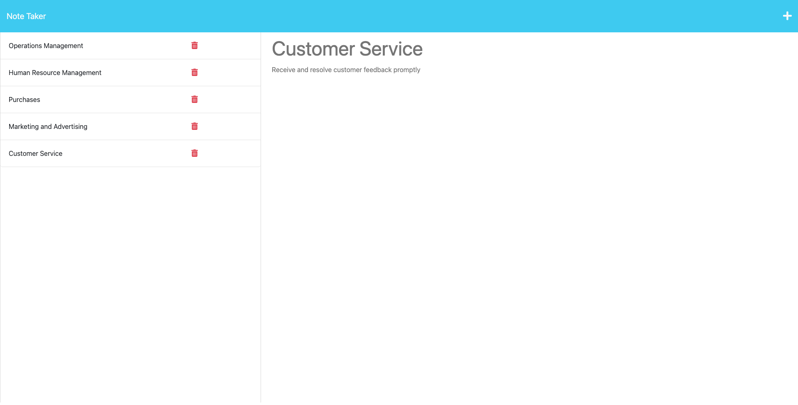

# Note Taker

## Description

The purpose of this project is to create an application called Note Taker. This application allows the end user to write and save notes. Further, it uses Express.js and an node engine to save and retrieve note data from a JSON file. Equipped with a connected front and back end, this application has been deployed to Heroku for end user interaction.

- This project was motivated by the desire provide end-users, namely small business owners, with an application to write and save notes.
- This application was designed to make note taking and task tracking easier for users.
- This tool can mitigate the hassle of simple record keeping while promoting sustainability.
- Lesson: Organization and production are correlated.

## Table of Contents

- [Installation](#installation)
- [Usage](#usage)
- [Credits](#credits)
- [License](#license)

## Installation

1. Install Node.js onto your computer
2. Open VS Code or a different code editor
3. npm install express
4. npm install --global short-unique-id or 
5. instantiate and use: const uid = new ShortUniqueId();

## Usage

Site link: https://bell-note-taker-3bc509f4e314.herokuapp.com

1. Right click on the server.js file, open in integrated terminal
2. Enter node or nodemon server.js
3. Enter heroku create
4. Visit the site link
5. Click the "Get Started" button
6. Add a note title with note text then click the save icon
7. To view task notes, click on the title in left column
8. Click the red trash icon to delete a task

## Credits

https://www.markdownguide.org/cheat-sheet/

https://gist.github.com/lukas-h/2a5d00690736b4c3a7ba

https://coding-boot-camp.github.io/full-stack/github/professional-readme-guide

## MIT License

Copyright (c) 2023 G6-2Flyy

Permission is hereby granted, free of charge, to any person obtaining a copy of this software and associated documentation files (the "Software"), to deal in the Software without restriction, including without limitation the rights to use, copy, modify, merge, publish, distribute, sublicense, and/or sell copies of the Software, and to permit persons to whom the Software is furnished to do so, subject to the following conditions:

The above copyright notice and this permission notice shall be included in all copies or substantial portions of the Software.

THE SOFTWARE IS PROVIDED "AS IS", WITHOUT WARRANTY OF ANY KIND, EXPRESS OR IMPLIED, INCLUDING BUT NOT LIMITED TO THE WARRANTIES OF MERCHANTABILITY, FITNESS FOR A PARTICULAR PURPOSE AND NONINFRINGEMENT. IN NO EVENT SHALL THE AUTHORS OR COPYRIGHT HOLDERS BE LIABLE FOR ANY CLAIM, DAMAGES OR OTHER LIABILITY, WHETHER IN AN ACTION OF CONTRACT, TORT OR OTHERWISE, ARISING FROM, OUT OF OR IN CONNECTION WITH THE SOFTWARE OR THE USE OR OTHER DEALINGS IN THE SOFTWARE.

